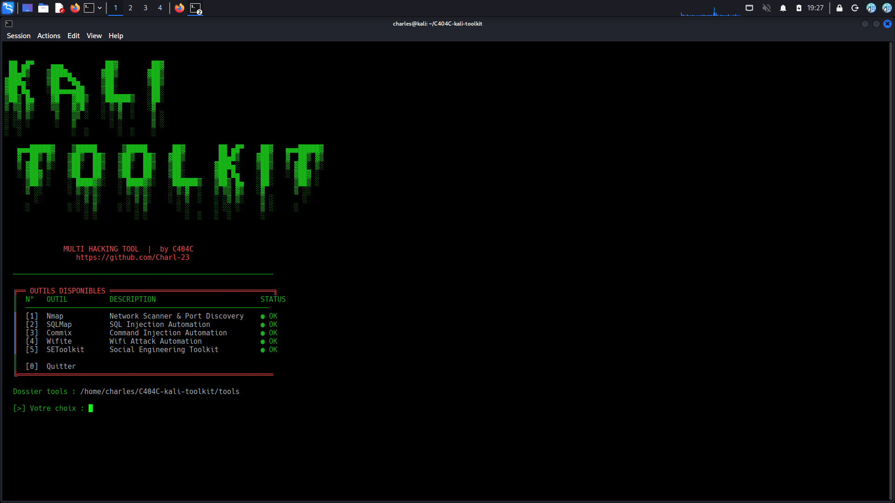

# 🛠️ Little Kali ToolKit

<p align="center">
  
  
  
  
</p>

<p align="center">
  Multi-tool Python automatisant les outils de pentest les plus utilisés sur Kali Linux.<br>
  Conçu pour simplifier et accélérer les phases de reconnaissance, d'exploitation et d'attaque réseau.
</p>

---

## 📸 Aperçu

<p align="center">
  
</p>

---

## 📁 Structure du projet

```
Little-Kali-ToolKit/
├── multitool.py          ← Launcher principal (menu interactif)
├── assets/
│   └── menu.png          ← Screenshot du menu
└── tools/
    ├── nmap.py           ← Automatisation Nmap
    ├── sqlmap.py         ← Automatisation SQLMap
    ├── commix.py         ← Automatisation Commix
    ├── wifite.py         ← Automatisation Wifite
    └── setoolkit.py      ← Lancement SEToolkit
```

---

## ⚙️ Prérequis

- **Kali Linux** (ou toute distribution Debian-based)
- **Python 3.x**
- **Les outils suivants installés et dans le PATH :**

| Outil | Installation |
|---|---|
| nmap | `sudo apt install nmap` |
| sqlmap | `sudo apt install sqlmap` |
| commix | `sudo apt install commix` |
| wifite | `sudo apt install wifite` |
| setoolkit | `sudo apt install set` |

- **Dépendance Python :**
```bash
pip install colorama
```

---

## 🚀 Installation & Lancement

```bash
git clone https://github.com/Charl-23/Little-Kali-ToolKit.git
cd Little-Kali-ToolKit
pip install colorama
python3 multitool.py
```

> Certains outils (Wifite, SEToolkit) nécessitent les droits root :
> ```bash
> sudo python3 multitool.py
> ```

---

## 🧰 Outils intégrés

### [1] 🔍 Nmap — Network Scanner & Port Discovery

**Nmap** est l'outil de référence pour la reconnaissance réseau. Il permet de scanner des machines sur un réseau pour découvrir quels ports sont ouverts, quels services tournent derrière, quel OS tourne sur la machine cible, et si des vulnérabilités connues sont présentes.

**Cas d'usage concrets :**
- Scanner un réseau local pour lister toutes les machines connectées
- Identifier les ports ouverts d'un serveur avant un pentest
- Détecter la version d'Apache, SSH, FTP d'une cible
- Vérifier si un firewall filtre certains ports
- Lancer des scripts NSE pour détecter des CVEs automatiquement

**Ce que le script automatise :**
- Choix guidé de la cible, du type de scan, des ports, du timing, des scripts NSE et des options d'évasion firewall

---

### [2] 💉 SQLMap — SQL Injection Automation

**SQLMap** est un outil d'exploitation automatique des injections SQL. Il détecte et exploite les failles SQL dans les paramètres d'une URL pour extraire des données d'une base de données (utilisateurs, mots de passe, tables, etc.).

**Cas d'usage concrets :**
- Tester si un paramètre GET/POST d'un site est vulnérable à l'injection SQL
- Extraire la liste des bases de données, tables et colonnes d'un serveur vulnérable
- Récupérer les identifiants et mots de passe stockés en base
- Valider la sécurité d'une application web lors d'un audit

**Ce que le script automatise :**
- Level 1 : scan simple sans options supplémentaires
- Level 2/3 : ajoute automatiquement `--banner`, `--dbs`, `--tables`, `--columns`, `--dump` selon le niveau choisi

---

### [3] ⚡ Commix — Command Injection Automation

**Commix** (Command Injection Exploiter) détecte et exploite les failles d'injection de commandes OS dans les applications web. Là où SQLMap cible les bases de données, Commix cible le système d'exploitation du serveur.

**Cas d'usage concrets :**
- Tester si un champ d'un formulaire web exécute des commandes sur le serveur
- Obtenir une exécution de commandes distante (RCE) sur un serveur vulnérable
- Identifier des failles d'injection dans des paramètres d'URL ou de cookies
- Audit de sécurité d'applications web exposant des appels système

**Ce que le script automatise :**
- Saisie de l'URL cible
- Choix du niveau d'injection (1 à 3)
- Choix du niveau d'énumération (utilisateurs, bases, colonnes, dump complet)

---

### [4] 📶 Wifite — Wifi Attack Automation

**Wifite** est un outil d'attaque automatisée sur les réseaux WiFi. Il capture les handshakes WPA/WPA2, casse les clés WEP, et tente de déchiffrer les mots de passe via une wordlist. Il gère automatiquement le mode monitor sur la carte réseau.

**Cas d'usage concrets :**
- Tester la robustesse du mot de passe de son propre réseau WiFi
- Capturer un handshake WPA2 pour un crackage hors-ligne
- Auditer la sécurité d'un réseau WiFi lors d'un test d'intrusion autorisé
- Identifier les réseaux vulnérables à WEP dans un environnement de test

**Ce que le script automatise :**
- Demande le chemin de la wordlist (`--dict`)
- Active `--kill` pour tuer les processus qui bloquent le mode monitor
- Vérifie que la wordlist existe avant de lancer

> ⚠️ Requiert les droits root et une carte WiFi compatible mode monitor.

---

### [5] 🎭 SEToolkit — Social Engineering Toolkit

**SEToolkit** (Social Engineer Toolkit) est un framework dédié aux attaques d'ingénierie sociale. Il permet de créer des campagnes de phishing, des faux sites web clonés, des payloads et des vecteurs d'attaque ciblant l'humain plutôt que la machine.

**Cas d'usage concrets :**
- Cloner un site web (ex: page de login) pour capturer des identifiants
- Créer une campagne de spear phishing lors d'un pentest Red Team
- Générer un payload pour tester la sensibilisation des utilisateurs
- Simuler une attaque d'ingénierie sociale dans un cadre professionnel autorisé

**Ce que le script automatise :**
- Vérification des droits root (obligatoire)
- Confirmation avant lancement
- Lancement direct de SEToolkit

---

## ⚠️ Avertissement légal

> Ce projet est destiné **uniquement à des fins éducatives et de tests sur des systèmes vous appartenant ou pour lesquels vous avez une autorisation explicite écrite.**
>
> L'utilisation de ces outils sur des systèmes tiers sans autorisation est **illégale** et peut entraîner des poursuites judiciaires.
>
> L'auteur décline toute responsabilité pour toute utilisation abusive ou illégale de ce projet.

---

## 👤 Auteur

**C404C**
- GitHub : [@Charl-23](https://github.com/Charl-23)

---

<p align="center">Made with ❤️ on Kali Linux</p>
